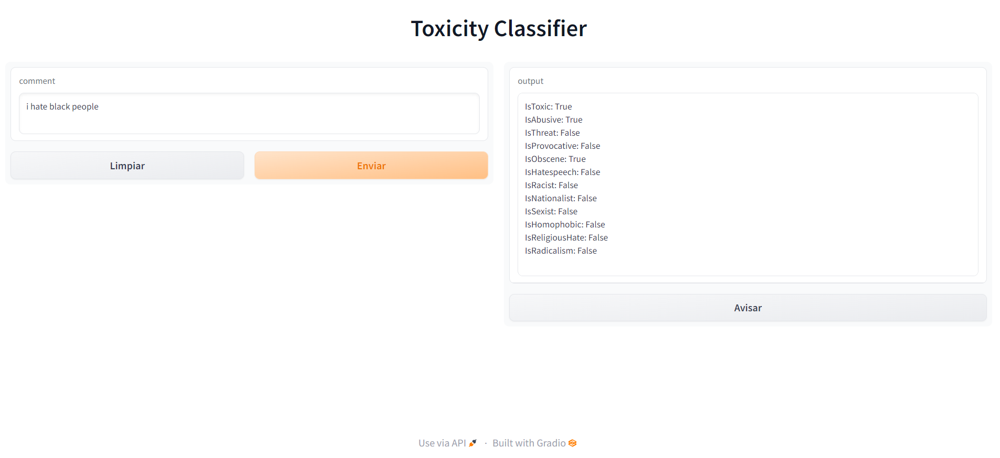

# EQUIPO_SUSTANTIVO
Proyecto NLP mensajes de odio en Youtube

Hemos creado un modelo que analiza un texto y predice si este es tóxico o no y siendo este tóxico, clasifica de que tipo de toxicidad se trata. Tanto el tratamiento de los datos como la creación del modelo se realiza en el cuaderno de Jupyter Lab que figura en el repositorio.

Para esto utilizamos una red neuronal recurrente de nombre LSTM (Long-Short Term Memory), y creamos una visulización utilizando Gradio.

Ejemplo de la visualización en Gradio: 

Para un futuro desarrollo en el cual se pueda predecir directamente todos los comentarios de un video de Youtube, creamos un Webscrapper que se conecta a la API de Youtube y obtiene todos los comentarios del video y los pasa a un formato csv para que puedan ser tratados por nuestro modelo y se puedan hacer las predicciones.

El flujo de trabajo que se ha seguido ha sido documentado en Notion (https://www.notion.so/98e58fb23c2e4bf887f3b52e0906bec0?v=48eff2e8818145bb87851503834bf836)
